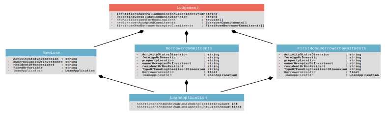

# 743_0_ABS_RBA_Housing_Finance

## Lodgement

#### IdentifiersAustralianBusinessNumberIdentifier ([Identifiers Australian Business Number Identifier](http://api.gov.au/definitions/definition/trc/de26)): string

A unique public identifier issued to all entities registered in the Australian Business Register (ABR), to be used in their dealings with government. Companies registered under the Corporations Law and business entities carrying on an enterprise in Australia are entitled to an ABN.

#### ReportingConsolidationBasisDimension ([Reporting Consolidation Basis Dimension](http://financialstatistics.pivotlab.io/define/dm916)): string

Must be set to *Domestic Books*

This dimension categorises the reported data according to the consolidation method.

#### newApplicationsForHousingLoans: [NewLoan](#newapplicationsforhousingloans)[]

#### newBorrowerAcceptedCommitments: [BorrowerCommitments](#newborroweracceptedcommitments)[]

#### firstHomeNewBorrowerAcceptedCommitments: [FirstHomeBorrowerCommitments](#firsthomenewborroweracceptedcommitments)[]

## NewLoan

#### ActivityStatusDimension ([Activity Status Dimension](http://financialstatistics.pivotlab.io/define/dm888)): string

Must be set to *New*

Information in relation to the status of an activity.

#### ownerOccupiedOrInvestment ([Loan Purpose Dimension](http://financialstatistics.pivotlab.io/define/dm347)): string

Information in relation to the intended purpose of the counterparty in regards to loan agreements entered into by the entity.

#### residentOrNonResident ([Institutional Unit Residency Dimension](http://financialstatistics.pivotlab.io/define/dm905)): string

This dimension categorises reported information according to the residency of the institutional unit or the issuer of the financial instrument.

#### fixedOrVariable ([Interest Rate Type Dimension](http://financialstatistics.pivotlab.io/define/dm365)): string

Information in relation to the interest rate type applicable to an interest-bearing agreement.

#### loanApplicatoin: [LoanApplication](#loanapplicatoin)

## BorrowerCommitments

#### ActivityStatusDimension ([Activity Status Dimension](http://financialstatistics.pivotlab.io/define/dm888)): string

Must be set to *New*

Information in relation to the status of an activity.

#### foreignOrDomestic ([Allowable Income Source Dimension](http://financialstatistics.pivotlab.io/define/dm936)): string

The information reported refers to allowable income, as defined by the entity's serviceability assessment policy.

#### propertyLocation ([Property Location Dimension](http://financialstatistics.pivotlab.io/define/dm909)): string

The location of the property that funds are being used for.

#### ownerOccupiedOrInvestment ([Loan Purpose Dimension](http://financialstatistics.pivotlab.io/define/dm347)): string

Information in relation to the intended purpose of the counterparty in regards to loan agreements entered into by the entity.

#### residentOrNonResident ([Institutional Unit Residency Dimension](http://financialstatistics.pivotlab.io/define/dm905)): string

This dimension categorises reported information according to the residency of the institutional unit or the issuer of the financial instrument.

#### TypeOfFundingCommitmentDimension ([Type Of Funding Commitment Dimension](http://financialstatistics.pivotlab.io/define/dm751)): string

The information reported is categorised according to what type of funding arrangement has been entered into either committed or uncommitted.

#### BorrowerAccepted: float

#### loanApplicatoin: [LoanApplication](#loanapplicatoin)

## FirstHomeBorrowerCommitments

#### ActivityStatusDimension ([Activity Status Dimension](http://financialstatistics.pivotlab.io/define/dm888)): string

Must be set to *New*

Information in relation to the status of an activity.

#### foreignOrDomestic ([Allowable Income Source Dimension](http://financialstatistics.pivotlab.io/define/dm936)): string

The information reported refers to allowable income, as defined by the entity's serviceability assessment policy.

#### propertyLocation ([Property Location Dimension](http://financialstatistics.pivotlab.io/define/dm909)): string

The location of the property that funds are being used for.

#### ownerOccupiedOrInvestment ([Loan Purpose Dimension](http://financialstatistics.pivotlab.io/define/dm347)): string

Information in relation to the intended purpose of the counterparty in regards to loan agreements entered into by the entity.

#### residentOrNonResident ([Institutional Unit Residency Dimension](http://financialstatistics.pivotlab.io/define/dm905)): string

This dimension categorises reported information according to the residency of the institutional unit or the issuer of the financial instrument.

#### TypeOfFundingCommitmentDimension ([Type Of Funding Commitment Dimension](http://financialstatistics.pivotlab.io/define/dm751)): string

The information reported is categorised according to what type of funding arrangement has been entered into either committed or uncommitted.

#### BorrowerAccepted: float

#### loanApplicatoin: [LoanApplication](#loanapplicatoin)

## LoanApplication

#### AssetsLoansAndReceivablesLendingFacilitiesCount ([Assets Loans And Receivables Lending Facilities Count](http://financialstatistics.pivotlab.io/define/de15085)): int

This is the number of lending facilities as at the relevant date. These are one or more accounts/lending agreements that: are for the same borrower(s); are approved at the same point in time and/or as part of the same application; are for the same purpose class (and property purpose if housing); and differ only by characteristics relating to interest rate type (fixed interest rate or variable interest rate) and/or repayment type (interest-only or amortising). The accounts comprising a lending facility may or may not be linked.

#### AssetsLoansAndReceivablesLoanAccountSwitchAmount ([Assets Loans And Receivables Loan Account Switch Amount](http://financialstatistics.pivotlab.io/define/de15097)): float

Record the net value as at the end of the previous reporting period of any loans that switched between categories in the current reporting period. 
Report the net value of loans that have moved into each category.

